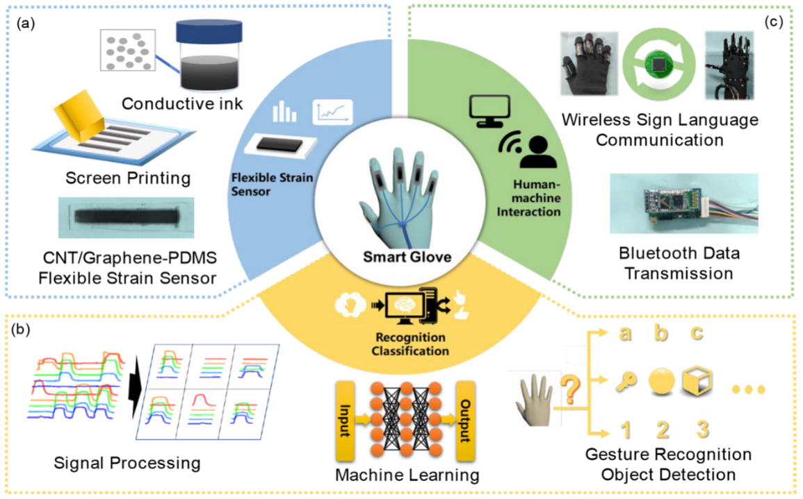
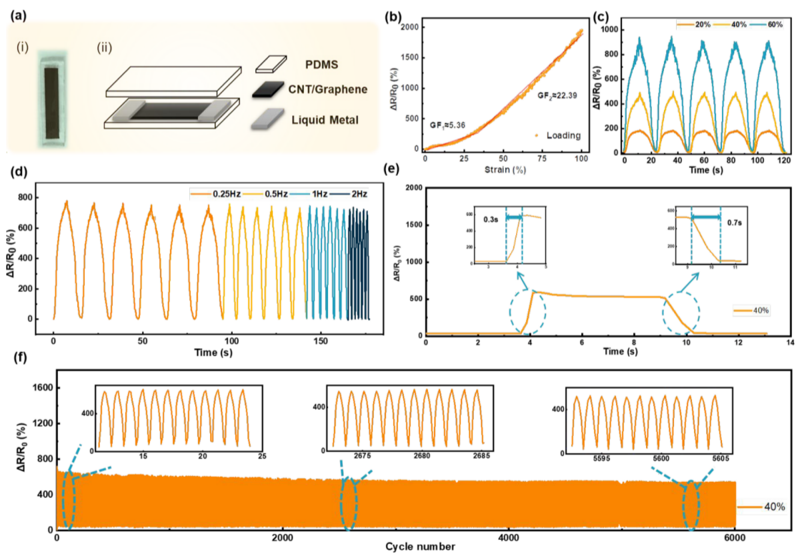

# Machine Learning-Enabled Intelligent Gesture Recognition and Communication System Using Printed Strain Sensors

ACS Appl. Mater. Interfaces 2023, 15, 51360−51369

---

## WHY

- 问题驱动 - 如何解决某个问题  
- 方法驱动 - xx 可以用来干什么
- 应用类的paper可以发的点在哪里

---

## ABSTRACT

- printed CNT-graphene/PDMS 应变传感器
- 智能手套
- 用ANN识别手势
- 驱动机器手

---

## INTRODUCTION

- 柔性应变传感器相对于传统传感器的优势
  - 传统传感器：体积大、质量大、结构刚性
  - 柔性传感器：耐用性、生物相容性、灵敏性
- ML的优势与前景
- 应变传感器制备
  - 在聚对苯二甲酸乙二醇酯（PET）衬底上丝网印刷碳纳米管-石墨烯墨水，然后通过PDMS衬底进行机械剥离转移

---

## System Design

---

## Sensor

 

---

## Finger Motion Detection and Analysis

---

## Gesture Recognition

---

## Wireless Communication System

---
## Wireless Communication System

---
## Answer
- 应用类的paper可以发的点在哪里
  - 具体的场景、具体的解决方案（实体）
  - 传感器信号采集 - 利用ML处理数据 - 输出
  - 工作量
    - 器件制备、采集部件、信号处理、信号传输、数据处理、硬件实现 
- 合作  
  
---

## Expansion

- 远程与屏幕交互

 
 

 - 摄像头采集：可能存在的问题是需要幅度较大的动作

 
 

- 设备采集
  - 数据手套
  - 磁力传感器
  - 毫米波雷达

---

## Expansion

- 设想
  - 做一个类似论文中提出的传感器智能手套以采集数据
  - 用ML进行数据处理，硬件实现远程屏幕交互

---

